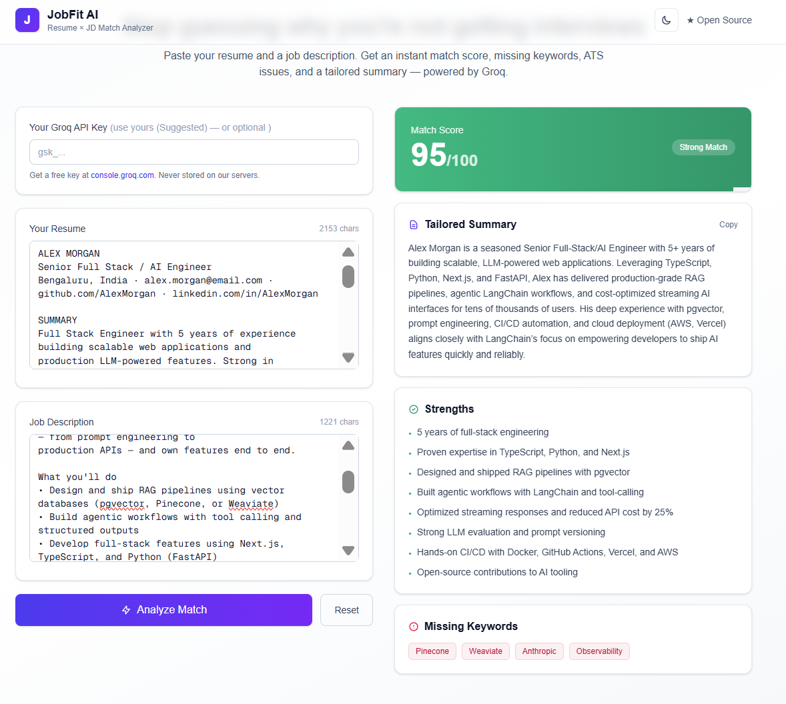

# JobFit AI

An open-source AI tool that compares your resume against any job description and gives you an honest match score, missing keywords, and a tailored summary.

**[Live Demo](https://jobfitai-nu.vercel.app/)** <!-- REPLACE with your Vercel URL --> · **[Report a Bug](https://github.com/manojkumar16122/JobFit/issues)** · **[Request a Feature](https://github.com/manojkumar16122/JobFit/issues)**

---

## The Problem

Most applications are filtered out by ATS before a human ever reads them. Job seekers rarely know *why* their resume didn't match — they just get silence.

JobFit AI answers one question honestly:

> *Does my resume actually match this job, and if not, what's missing?*

---

## Features

- **Match Score (0–100)** — color-coded, no flattery
- **Missing Keywords** — what the ATS is filtering you out for
- **Strengths** — what's already working in your favor
- **Tailored Summary** — copy-paste ready for your resume header
- **Bring Your Own Key** — optional; your Groq key is never stored on the server
- **Dark / Light mode**
- **Fully responsive**

---

## Screenshot



---

## Tech Stack

| Layer | Tech |
|---|---|
| Framework | Next.js 15 (App Router) |
| Language | TypeScript |
| Styling | Tailwind CSS v4 |
| LLM | Groq (`openai/gpt-oss-20b`) |
| Validation | Zod |
| Theming | next-themes |
| Deploy | Vercel |

---

## How It Works

```
Browser (Next.js UI)
    │  POST /api/analyze
    ▼
API Route (Vercel Serverless)
    │  - Validates input (Zod)
    │  - Uses user's key or server key
    │  - Calls Groq with JSON mode
    ▼
Groq LLM
    │  Returns structured JSON
    ▼
UI renders score, strengths, missing keywords, summary
```

The API route exists so the browser never exposes your Groq API key.

---

## Getting Started

### Requirements

- Node.js 20+
- Free Groq API key → [console.groq.com/keys](https://console.groq.com/keys)

### Setup

```bash
git clone https://github.com/manojkumar16122/JobFit.git
cd JobFit
npm install
cp .env.example .env.local
# Add your GROQ_API_KEY to .env.local
npm run dev
```

Open [http://localhost:3000](http://localhost:3000).

### Environment Variables

```bash
GROQ_API_KEY=gsk_xxxxxxxxxxxxxxxxxxxxxxxxxxxxxxxx
```

Never commit `.env.local`.

---

## Deploy to Vercel

1. Push the repo to GitHub
2. Import it on [vercel.com](https://vercel.com)
3. Add `GROQ_API_KEY` under **Settings → Environment Variables**
4. Deploy

---

## Project Structure

```
JobFit/
├── app/
│   ├── api/analyze/route.ts   # Serverless LLM proxy
│   ├── providers.tsx          # Theme provider
│   ├── theme-toggle.tsx       # Dark/light toggle
│   ├── page.tsx               # Main UI
│   ├── layout.tsx             # Root layout
│   └── globals.css            # Tailwind + dark variant
├── public/
├── .env.example
├── LICENSE
└── README.md
```

---

## Roadmap

- [x] Match score, missing keywords, tailored summary
- [ ] PDF resume upload
- [ ] ATS issue detection
- [ ] Cover letter generator
- [ ] Interview question predictions
- [ ] Save analysis history

---

## Contributing

Pull requests are welcome. For major changes, open an issue first to discuss what you'd like to change.

```bash
git checkout -b feature/your-feature
git commit -m "feat: add your feature"
git push origin feature/your-feature
```

Then open a Pull Request.

---

## License

[MIT](./LICENSE)

---

## Author

**Manoj Kumar**
[GitHub](https://github.com/manojkumar16122) · [LinkedIn](https://www.linkedin.com/in/manojkumar-v-39b6b7230/)

If this helped you, give the repo a ⭐ — it helps others find it too.
